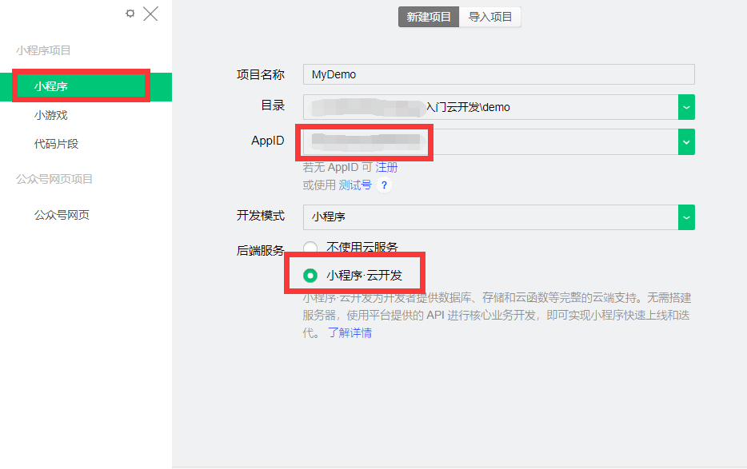
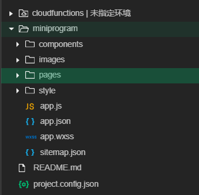
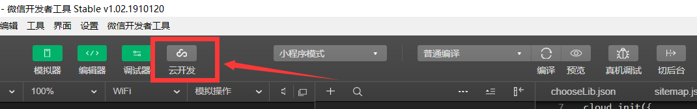
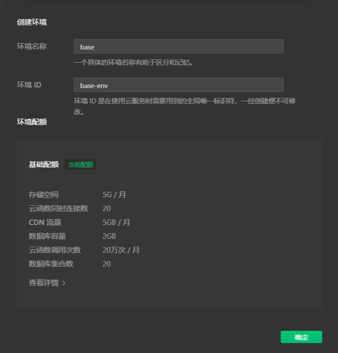
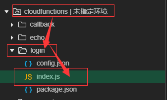
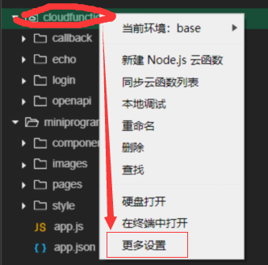
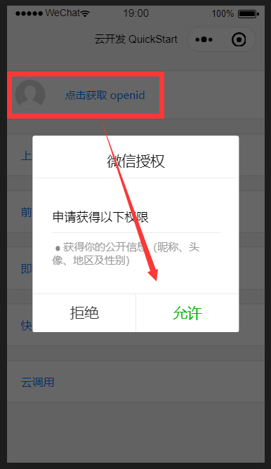

# 你的第一个小程序

登录[微信开发者工具](https://developers.weixin.qq.com/miniprogram/dev/devtools/download.html)，你会看到以下内容：

    

在这里需要注意的是：

1. 选择**小程序·云开发**。
2. 填入你注册公众平台账号时获得的AppID。

点击新建项目之后，程序会自动为你生成一个开发Demo，你可以跟着这个Demo熟悉云开发的特性。

##  工程结构

让我们逐步分析一个小程序的工程结构：

    

作为一个小程序，它应该有：

- `components`：存放一些可在本地运行的组件，例如一些全局函数之类的，这个视个人开发习惯而定。
- `resources`：存放一些资源文件，例如图中的`images`文件夹，存放的是小程序要用到的图片；你也可以新建一个`audio`文件，用于存放音频资源，同样是一个视个人开发习惯而定的内容。
- `pages`：我们都知道，开发一个小程序，实际上就是在开发一个网页。这个文件夹存放的就是各个页面的`html、css、js`等内容，对应到微信小程序的开发，就是以下内容：
  + `.js`：主要的业务逻辑单元。
  + `.wxss`：其实就是`css`文件，只不过微信增添了一些新的内容。
  + `.wxml`：就是我们熟悉的`html`文件。
- `style`：该文件夹存放一些全局的样式表，例如我们等会要介绍的第三方组件库，就可以将它存放到此。
- `app.js等`：就像C语言中有一个`main`函数一样，小程序也要有个入口页面，在这里app.js`等文件定了小程序的全局变量、有哪些页面、哪个页面是入口页面等信息。
- `sitemap.json`：我们在目前阶段不太需要关心这个文件。简单介绍一下，就是当用户在微信中搜索小程序的时候，该文件定义了用户所能搜索到的页面内容，便于对特定关键字就行引流（因为就像访问一个普通网站一样，实际上微信小程序不一定要从入口页面进入）。
- `project.config.json`：这是一个比较重要的文件，但是目前我们也不用关心。简单介绍一下：这个文件定义了小程序的结构和内容等信息，类似Node工程的`package.json`文件。

---

那么，作为一个云开发的小程序，它应该又有哪些内容呢：

- `cloudfunction`：该文件夹存放了一个个云函数，例如拥有最高权限的数据库读写操作等。
- `云控制台`：该控制台需要你手动开启：

    

开通云控制台时，会让你创建一个**云环境**。

如何理解这个云环境呢？你可以把它理解成一台VPS，这个VPS已经替你搭建好了数据库、Devtool Kit等云函数运行所需要的环境。

    

就像租用一台云服务器需要为流量付费一样，每个云环境实际上是单独收费的。不过，每个云环境实际上都拥有一定的免费流量，作为一个个人开发者，这些免费流量实际上已经是足够的了。

让我们说说开通云开发具有哪些特殊的内容吧：

1. 数据库，你不用再自行搭建自己的数据库了；而且微信提供了统一的API供你写入写出数据库。
2. 文件存储，除了读写基本的字符串，微信也提供了文件的存储接口。
3. 数据分析，例如小程序的访问量、客服反馈等核心业务内容，你不必在搭建自己的数据分析平台。
4. 云函数，你可以简单把云函数当成一个具有最高权限的全局函数，该函数不运行在用户的手机微信客户端上。

---

接下来，我们先来实现我们的一个云函数。

每一个做过网站的人，要做一个系统，首先要写的就是用户注册/登录。这是一个非常麻烦的东西，每个写过的人都知道。好在，云开发为我们简化了个这个内容。

- 微信小程序可以使用微信的统一登录接口快速登录，但不使用云开发的话，你要做一堆复杂的工作以保证你的登录环境(服务器)是安全的；而对于云开发就很简单了，因为你的服务器(云环境)实际上就是腾讯自己的服务器，你所需要做的就是创建一个云函数，云函数运行在腾讯的服务器中(这当然是符合腾讯的安全认证标准的)，然后调用相应API即可。

让我们打开以下内容：

    

在Demo中，这个函数文件实际上已经替我们实现了相应接口的调用，我们先不关心具体的API细节，先把这个功能实现了再说。

我们简单上传这个云函数：

    
	

1. 首先，按照上图所示，选择这个云函数要依赖的服务器(云环境)。
2. 右键`login`文件夹，选择`创建并部署：安装环境依赖`。
3. 等待环境安装完毕和云函数上传完毕，点击开发工具中模拟器中的相应按钮，即可发现可以利用微信的信息进行登录了。

    
	

至此，我们初步了解了：

1. 什么是云环境。
2. 什么是云函数。
3. 如何从0开始构建云环境并实现一个云函数的部署。