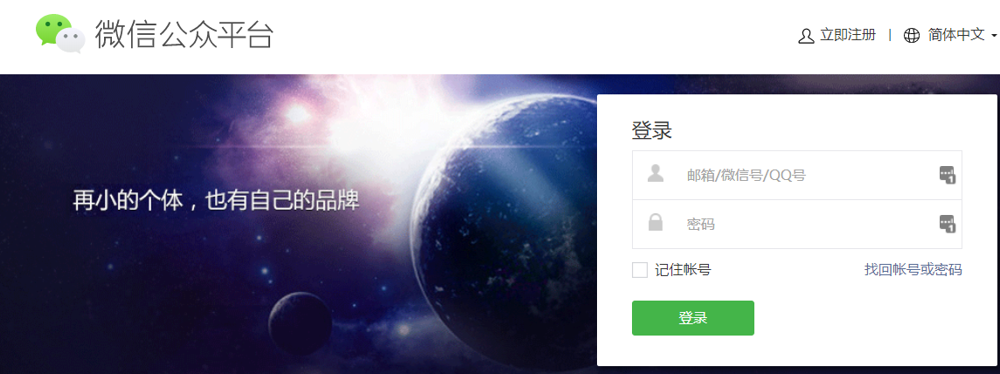
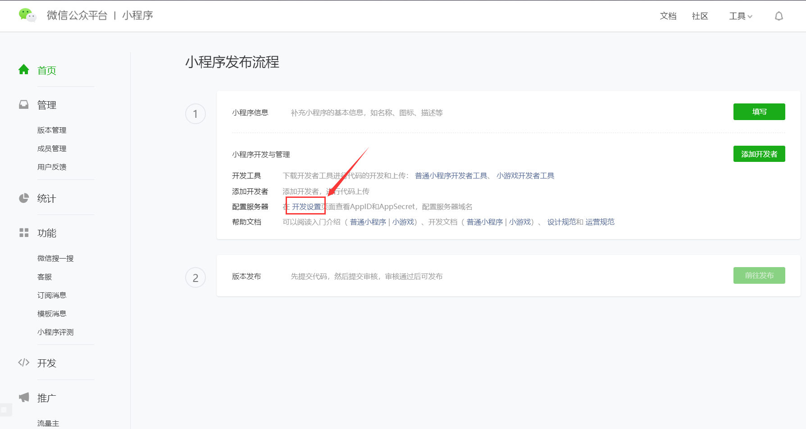

# 注册微信公众平台

> 微信公众平台是面向开发者、公众号运营者的社区平台。
>
> 与我们日常所使用的个人微信不同，它的账号系统是独立，即每一个“小程序/公众号”对应一个公众平台账号(你也可以认为是类似Oracle的开发者账号)。
>
> 然后每个公众平台账号会捆绑若干个个人微信账号作为管理者、运营者。

    

因此，作为一名个人开发者，要想开发一个微信小程序，我们首先应当取得这个开发者身份：

1. 注册一个**公众平台账号**。
2. 把你的**个人微信账号**设置为这个小程序(公众平台账号)的拥有者/超级管理员。

你可以到这个[注册地址](https://mp.weixin.qq.com/wxopen/waregister?action=step1&token=&lang=zh_CN)申请公众平台账号，也可以自行百度官网文档，查看更多相关协议后再及逆行注册。

---

当你成功注册了公众平台的小程序开发者身份之后，你将看到以下内容：

    

那么恭喜你，你可以在图中所标示的**开发设置**中获取你的AppID，享受云开发的便捷了。

在正式Code你的第一行代码之前，我们需要了解一下什么是云开发。